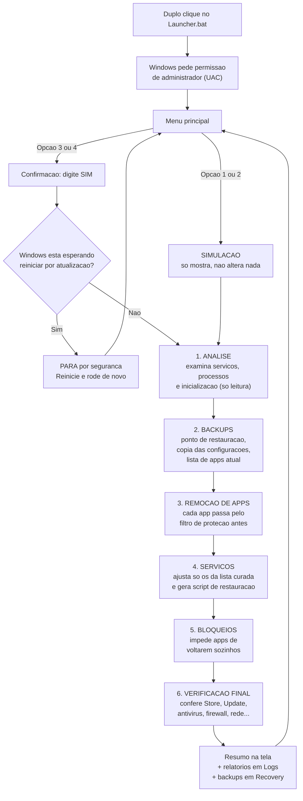

# WinDebloat

**Deixe seu Windows mais limpo, com segurança**

[](LICENSE)
[](#requisitos)
[](#requisitos)
[](https://github.com/edsilas/WinDebloat/releases)


---

**Aplica-se a:** Windows 10 · Windows 11 (64 bits)

Seu computador veio de fábrica cheio de aplicativos que você nunca pediu — jogos,
apps de notícias, propaganda no Menu Iniciar? O **WinDebloat** remove esse excesso
para você, sem colocar em risco nada que seja importante para o funcionamento do
Windows.

## Neste artigo

- [Visão geral](#visão-geral)
- [Como funciona (fluxo visual)](#como-funciona-fluxo-visual)
- [Requisitos](#requisitos)
- [Introdução](#introdução)
- [Referência do Launcher](#referência-do-launcher)
- [Modos de otimização (padrão e agressivo)](#modos-de-otimização-padrão-e-agressivo)
- [O que exatamente é alterado (lista completa)](#o-que-exatamente-é-alterado-lista-completa)
- [Decisões de projeto (o porquê de cada escolha)](#decisões-de-projeto-o-porquê-de-cada-escolha)
- [Escolher o que manter (Config.psd1)](#escolher-o-que-manter-configpsd1)
- [Guia de uso](#guia-de-uso)
- [Reverter alterações](#reverter-alterações)
- [Perguntas frequentes](#perguntas-frequentes)
- [Solucionar problemas](#solucionar-problemas)
- [Recomendações](#recomendações)
- [Referência técnica](#referência-técnica)
- [Licença e autoria](#licença-e-autoria)
- [Próximas etapas](#próximas-etapas)

---

## Visão geral

### O que o WinDebloat faz

Ele remove aplicativos pré-instalados que a maioria das pessoas não usa:

| Categoria | Exemplos |
| --- | --- |
| Jogos e extras da Xbox | Game Bar, Solitaire, serviços de jogos |
| Apps de notícias e clima da Bing | News, Weather, Sports, Finance |
| Apps pouco usados | Skype, Cortana, Clipchamp, Paint 3D, Visualizador 3D, Mapas, Gravador de Som, Filmes e TV, Groove Música |
| Propaganda disfarçada | Sugestões no Menu Iniciar, apps "patrocinados" que se instalam sozinhos, conteúdo promocional |

Além de remover, ele **impede que esses apps voltem sozinhos** — o Windows tem o
hábito de reinstalar alguns deles, e o WinDebloat desliga esse comportamento.

> [!NOTE]
> A lista completa do que será removido aparece na tela durante a simulação,
> antes de qualquer alteração. Você sempre vê primeiro e decide depois.

### O que ele NUNCA remove

| Fica no lugar | Por quê |
| --- | --- |
| **Windows Update** | Seu computador continua recebendo atualizações normalmente |
| **Microsoft Store** | Você pode reinstalar qualquer app removido, de graça, quando quiser |
| **Antivírus (Defender), Firewall e SmartScreen** | Sua proteção continua completa |
| **Login e contas** (senha, PIN, biometria, conta Microsoft, redes corporativas) | Você continua entrando no PC normalmente |
| **Fotos, Bloco de Notas e Paint** | Os apps úteis do dia a dia permanecem |
| **Acessibilidade** (Narrador e recursos de assistência) | Nada de acessibilidade é tocado |
| **Recuperação do sistema e BitLocker** | Os recursos de emergência e criptografia ficam intactos |

### Como a segurança é garantida

O WinDebloat foi construído em camadas de proteção:

1. **Modo simulação primeiro.** Por padrão, ele apenas mostra o que faria, sem
   mudar absolutamente nada. Você revisa e só executa de verdade se quiser.
2. **Lista de proteção interna.** Mesmo que algo entrasse por engano na lista de
   remoção, um filtro de segurança barra qualquer componente essencial.
3. **Backup automático antes de tudo.** Ele cria um ponto de restauração do
   Windows (uma "fotografia" do sistema, que permite voltar atrás), salva cópias
   das configurações que serão alteradas e anota a lista completa de apps antes
   e depois.
4. **Verificação final.** Ao terminar, confere um por um se os componentes
   essenciais continuam presentes e avisa se algo estiver fora do esperado.
5. **Cem por cento offline.** Não acessa a internet, não envia dados e não
   instala nada de terceiros.

---

## Como funciona (fluxo visual)

O diagrama abaixo mostra o caminho completo, do duplo clique ao computador
limpo. Repare que **todas as proteções vêm antes de qualquer alteração**: a
ferramenta primeiro olha, depois guarda backups, e só então age — e sempre
confere tudo no final.



Na **simulação** (opções 1 e 2), as etapas 3, 4 e 5 apenas **mostram** o que
fariam — nada é alterado, mas você recebe o relatório completo igual.

---

## Requisitos

| Requisito | Detalhes |
| --- | --- |
| Sistema operacional | Windows 10 ou Windows 11, versão de 64 bits (a própria ferramenta confere e avisa se não for) |
| Conta de usuário | Permissão de **administrador** — se o computador é seu e você o configurou, sua conta provavelmente já é |
| PowerShell | Windows PowerShell 5.1 (já incluído no Windows) ou PowerShell 7+ — **nenhuma instalação é necessária** |
| Internet | Não é necessária: a ferramenta é totalmente local |
| Programas adicionais | Nenhum |

---

## Introdução

### Baixar e preparar a ferramenta

Siga cada passo na ordem, sem pular nenhum:

1. **Baixe o projeto.** Nesta página do GitHub, clique no botão verde
   **Code** e depois em **Download ZIP**. O arquivo (algo como
   `WinDebloat-main.zip`) será salvo na sua pasta **Downloads**.

2. **Extraia o ZIP.** Abra a pasta Downloads, clique com o **botão direito** no
   arquivo baixado e escolha **Extrair Tudo...**. Na janela que abrir, clique em
   **Extrair**. Uma nova pasta será criada com os arquivos do projeto.

3. **Confira o conteúdo.** Dentro da pasta extraída devem estar, entre outros,
   os arquivos **`Launcher.bat`** e **`Core.ps1`**. Esses dois precisam ficar
   **sempre juntos, na mesma pasta**. Se quiser, mova a pasta inteira para um
   lugar definitivo (por exemplo, Documentos) — mas mova a pasta inteira, nunca
   os arquivos separados.

4. **Desbloqueie os arquivos (recomendado).** O Windows marca arquivos vindos
   da internet, o que pode gerar avisos extras. Para evitar isso:
   1. Clique com o **botão direito** em `Launcher.bat` e escolha **Propriedades**.
   2. Na parte de baixo da aba **Geral**, se existir uma caixa escrita
      **Desbloquear**, marque-a e clique em **OK**.
   3. Repita o mesmo para o arquivo `Core.ps1`.
   4. Se a caixa "Desbloquear" não aparecer, está tudo certo — siga em frente.

> [!IMPORTANT]
> Não execute nada de dentro do ZIP sem extrair. O Windows abre ZIPs como se
> fossem pastas, mas os programas não funcionam corretamente lá de dentro.

Pronto. Não existe "instalação": o programa roda direto da pasta.

---

## Referência do Launcher

O **Launcher** é a porta de entrada do WinDebloat: um menu simples que cuida de
tudo para você — pede a permissão de administrador, prepara o ambiente e executa
a limpeza no modo que você escolher.

### Avisos do Windows na abertura

Ao dar **duplo clique em `Launcher.bat`**, o Windows pode mostrar até dois
avisos, nesta ordem — ambos são normais:

1. **Aviso do SmartScreen** — tela azul escrita "O Windows protegeu o
   computador". Aparece porque o arquivo veio da internet e não tem assinatura
   digital de uma empresa. Clique em **Mais informações** e depois em
   **Executar assim mesmo**. Esse aviso costuma aparecer apenas na primeira vez
   (e não aparece se você desbloqueou os arquivos na preparação).
2. **Controle de Conta de Usuário** — janela perguntando "Deseja permitir que
   este aplicativo faça alterações no seu dispositivo?". Clique em **Sim** — é
   a permissão de administrador, necessária para remover apps do sistema.

### O menu

Em seguida, uma janela preta se abre com este menu:

```
 ==================================================================
   WinDebloat  -  Limpeza segura para Windows 10/11
 ==================================================================
   Mecanismo ..: Windows PowerShell 5.1
   Pasta ......: C:\...\WinDebloat
   Listas .....: padrao [opcional: copie Config.exemplo.psd1]
   Ultima acao : nenhuma nesta sessao
 ------------------------------------------------------------------
   SIMULACOES (mostram tudo sem alterar nada)
   [1] Simulacao padrao        <-- recomendado primeiro
   [2] Simulacao agressiva

   EXECUCOES REAIS (pedem confirmacao SIM)
   [3] Execucao real padrao      remove apps, otimiza servicos
   [4] Execucao real agressiva   inclui ajustes avancados

   UTILITARIOS
   [R] Ver ultimo relatorio      abre Debloat.log no Bloco de Notas
   [B] Abrir pasta de backups    abre a pasta Recovery
   [5] Sair
 ==================================================================
   Desenvolvido por Edsilas | Apache License 2.0

 Escolha uma opcao [1/2/3/4/5/R/B]:
```

O painel superior mostra a situação atual: qual PowerShell está em uso, a pasta
do programa, se você tem um `Config.psd1` personalizado e o resultado da última
ação da sessão. Ele é atualizado a cada retorno ao menu.

Para escolher, digite o número da opção e pressione **Enter**.

> [!NOTE]
> Ao final das opções 1 a 4, o programa **não fecha**: ele mostra o resultado e
> volta automaticamente ao menu, permitindo uma nova escolha. Para encerrar,
> use sempre a opção 5.

### Opções 1 e 2 — Simulações (Dry Run)

Um "ensaio geral": o programa percorre todo o processo e mostra na tela, linha
por linha, exatamente o que faria — mas **não altera nada** no computador.
A opção 1 simula o modo padrão; a opção 2 simula o **modo agressivo** (veja
[Modos de otimização](#modos-de-otimização-padrão-e-agressivo)). Comece sempre
pela simulação do modo que pretende usar. Ao terminar, o programa volta ao
menu. O passo a passo completo está em
[Etapa 1: rodar a simulação](#etapa-1-rodar-a-simulação-obrigatória-antes-de-tudo).

### Opções 3 e 4 — Execuções reais

A limpeza de verdade: analisa o sistema, cria os backups, remove os apps,
otimiza os serviços e aplica os bloqueios de reinstalação. A opção 3 usa o
modo padrão (conservador); a opção 4 usa o **modo agressivo**, com um aviso de
atenção reforçado. Ambas exigem uma confirmação extra (digitar `SIM`) como
trava contra execuções acidentais, e ambas voltam ao menu ao terminar. O passo
a passo completo está em
[Etapa 3: executar a limpeza](#etapa-3-executar-a-limpeza-de-verdade).

### Opção 5 — Sair

Encerra o programa. É a **única forma de fechar o Launcher**: as demais opções
sempre retornam ao menu ao final. Nenhuma alteração é feita ao sair.

### Opções R e B — Utilitários

Dois atalhos de conveniência, que não alteram nada no sistema:

- **[R] Ver último relatório** — abre o `Debloat.log` no Bloco de Notas, para
  revisar a última simulação ou execução sem procurar a pasta manualmente.
  Se ainda não houver relatório, o programa avisa e sugere rodar uma simulação.
- **[B] Abrir pasta de backups** — abre a pasta `Recovery` no Explorador de
  Arquivos, onde ficam o script de restauração de serviços, os arquivos `.reg`
  e as listas de apps antes/depois.

Ao final de cada ação, o programa também exibe um **painel de resultado** com a
ação executada, a situação em linguagem clara (por exemplo, "sucesso, sem
alertas" ou "reinicialização pendente; reinicie e rode de novo"), os caminhos
dos relatórios e backups e, após execuções reais bem-sucedidas, o lembrete de
reiniciar o computador.

### Modo direto (opcional)

O Launcher também aceita o modo direto, sem menu. Abra o Prompt de Comando na
pasta do programa e digite:

```
Launcher.bat dry               (simulação padrão)
Launcher.bat dry-aggressive    (simulação agressiva)
Launcher.bat real              (execução real padrão)
Launcher.bat real-aggressive   (execução real agressiva)
```

O funcionamento e as confirmações são os mesmos. A diferença é que, no modo
direto, o programa **encerra ao final** (com o código de resultado), em vez de
voltar ao menu — comportamento adequado para uso em scripts e automação.

---

## Modos de otimização (padrão e agressivo)

Além de remover aplicativos, o WinDebloat agora **analisa e otimiza serviços**
do Windows, em dois níveis à sua escolha:

### O que a análise do sistema faz

Antes de qualquer alteração, uma fase **somente leitura** examina o estado do
computador: quantos serviços existem e estão em execução, os dez processos que
mais consomem memória e quais programas iniciam junto com o Windows. O resumo
aparece na tela e o relatório completo é salvo em `Logs\Analise_Sistema_*.txt`.

> [!NOTE]
> Os programas de inicialização são apenas **relatados**, nunca alterados —
> são escolhas pessoais suas (antivírus, mensageiros, drivers), e mexer neles
> automaticamente poderia causar mais problemas do que benefícios.

### Modo padrão (conservador)

Ajusta uma lista curada de serviços dispensáveis — telemetria, fax, modo de
demonstração de loja, serviços da Xbox (cujos apps já foram removidos), entre
outros — preferindo o tipo de início **Manual**: o serviço deixa de consumir
recursos, mas **sobe sozinho se algo precisar dele**, preservando total
compatibilidade.

### Modo agressivo

Faz tudo o que o padrão faz e vai além: amplia a lista de serviços (Superfetch,
Relatório de Erros, geolocalização, entre outros), desativa por completo a
telemetria dispensável e a captura de tela/vídeo em segundo plano do Game DVR
(que consome CPU e GPU continuamente, mesmo sem uso), e reduz a coleta de
diagnóstico ao mínimo suportado pela sua edição do Windows.

### As mesmas proteções valem para os dois modos

- **Guarda de proteção de serviços**: Windows Update, Defender, Firewall, rede,
  áudio, impressão, Bluetooth, busca do Menu Iniciar e dezenas de outros
  serviços essenciais estão em uma lista intocável — mesmo que entrassem por
  engano na lista de ajustes, seriam barrados.
- **Reversão tripla**: ponto de restauração, estado anterior de cada serviço
  registrado no log, e um **script pronto de restauração**
  (`Recovery\Restaurar_Servicos_*.ps1`) que devolve cada serviço exatamente ao
  estado em que estava — incluindo início automático atrasado.
- **Simulação para os dois modos**: as opções 1 e 2 do menu mostram tudo antes,
  sem alterar nada.
- **Validação reforçada**: ao final, além das checagens existentes, a ferramenta
  confirma que **nenhum serviço crítico ficou desabilitado**.

---

## O que exatamente é alterado (lista completa)

Transparência total: tudo o que a ferramenta pode tocar no seu computador está
documentado abaixo, com o impacto real no dia a dia. Nada além disto é alterado.

### Aplicativos removidos

| Grupo | Aplicativos | Você vai sentir falta? |
| --- | --- | --- |
| Xbox e jogos | Xbox App, Game Bar, Gaming Services, Identity Provider, TCUI, Speech to Text, Solitaire | Só se você joga no PC — nesse caso, preserve-os pelo [Config.psd1](#escolher-o-que-manter-configpsd1) |
| Notícias e clima | Bing News, Weather, Sports, Finance | O clima e as notícias saem do Menu Iniciar; sites e outros apps de clima seguem normais |
| Comunicação | Skype, Teams (versão pessoal), People | O Teams corporativo (instalado pela empresa) **não** é este e continua intacto |
| Criação e mídia | Clipchamp, Paint 3D, Visualizador 3D, Filmes e TV, Groove Música, Gravador de Som | Fotos e o Paint clássico ficam; vídeos e músicas abrem em outros players |
| Utilitários | Cortana, Feedback Hub, Obter Ajuda, Assistência Rápida, Mapas, To Do, Office Hub, OneConnect, Family, Alarmes, Câmera, Vincular ao Celular, Mixed Reality Portal, Dev Home, Power Automate | Alarmes, Câmera e Vincular ao Celular são os mais sentidos — preserve-os pelo Config.psd1 ou reinstale pela Store em segundos |

### Serviços ajustados

"Manual" significa que o serviço **para de rodar sozinho**, mas **liga
automaticamente se algo precisar dele** — por isso é a escolha padrão, sem
risco de compatibilidade. "Desabilitado" é reservado ao que não tem uso no
dia a dia.

| Serviço | O que ele faz | Modo padrão | Modo agressivo | Impacto no uso |
| --- | --- | --- | --- | --- |
| DiagTrack | Envia dados de uso à Microsoft (telemetria) | Manual | Desabilitado | Nenhum |
| dmwappushservice | Mensagens de operadora (WAP) | Manual | Manual | Nenhum |
| MapsBroker | Baixa mapas para o app Mapas (removido) | Manual | Manual | Nenhum |
| Fax | Envio de fax | Manual | Desabilitado | Só se você usa fax |
| RetailDemo | Modo de demonstração de loja | Desabilitado | Desabilitado | Nenhum |
| WMPNetworkSvc | Compartilhamento do Media Player | Manual | Manual | Nenhum |
| RemoteRegistry | Acesso remoto ao registro | Desabilitado | Desabilitado | Nenhum (melhora a segurança) |
| Serviços Xbox Live (3) | Login e saves de jogos Xbox | Manual | Manual | Nenhum — se você abrir um jogo, eles ligam sozinhos |
| SysMain (Superfetch) | Pré-carrega apps na memória | *(não mexe)* | Manual | Em SSD, nenhum; a diferença some |
| WerSvc | Relatório de Erros do Windows | *(não mexe)* | Manual | Nenhum no uso normal |
| lfsvc | Localização (GPS/geolocalização) | *(não mexe)* | Manual | Apps que pedem sua localização podem levar 1–2s a mais na primeira vez |
| TrkWks | Rastreia atalhos entre computadores | *(não mexe)* | Manual | Nenhum |
| WalletService | Carteira digital (recurso abandonado) | *(não mexe)* | Manual | Nenhum |

### Configurações aplicadas (bloqueios anti-reinstalação)

Aplicadas nos dois modos, valem para o usuário atual **e** para contas criadas
no futuro:

| Configuração | Antes | Depois |
| --- | --- | --- |
| Apps "patrocinados" (Candy Crush e similares) instalando sozinhos | Ligado | **Desligado** |
| Sugestões de apps no Menu Iniciar | Ligado | **Desligado** |
| Dicas e propaganda na tela de bloqueio | Ligado | **Desligado** |
| Reinstalação automática de apps promocionais após atualizações | Ligado | **Desligado** |
| Sugestões da internet (Bing) na busca do Menu Iniciar | Ligado | **Desligado** |

Exclusivas do **modo agressivo**:

| Configuração | Antes | Depois | Impacto |
| --- | --- | --- | --- |
| Coleta de dados de diagnóstico | Completa | **Mínima que sua edição permite** | Nenhum no uso |
| Game DVR (gravação de jogos em segundo plano) | Ligado | **Desligado** | Win+G e a gravação automática de gameplay param de funcionar; jogos rodam mais leves |

### Mudança de comportamento que você vai notar

Um exemplo prático do bloqueio de busca: hoje, ao digitar "receita de bolo" no
Menu Iniciar, o Windows mistura resultados do seu PC com resultados do Bing.
Depois da limpeza, **a busca do Menu Iniciar mostra apenas o que está no seu
computador** — apps, arquivos e configurações. Para pesquisar na internet, use
o navegador. A maioria das pessoas considera isso uma melhoria (busca mais
rápida e sem distração), mas é uma mudança de hábito que você deve conhecer
antes.

---

## Decisões de projeto (o porquê de cada escolha)

Estas escolhas moldam o comportamento da ferramenta — conhecê-las ajuda a
confiar no que ela faz (e no que ela se recusa a fazer):

**Por que "Manual" em vez de "Desabilitado" nos serviços?** Um serviço em
Manual é como uma luz com sensor de presença: apagada até alguém precisar.
Desabilitado é lacrar o interruptor — se algum programa precisar do serviço no
futuro, ele falha com erros confusos. Por isso, Desabilitado só é usado onde
não existe cenário legítimo de uso (fax, modo de loja, registro remoto).

**Por que os programas de inicialização são só relatados, nunca removidos?**
Porque são escolhas *suas*: seu antivírus, seu mensageiro, o driver da sua
impressora. Uma ferramenta automática não tem como saber o que é dispensável
para você — removê-los às cegas causaria mais problemas do que benefícios. O
relatório em `Logs\Analise_Sistema_*.txt` lista tudo para *você* decidir.

**Por que a telemetria vai para o nível "mínimo" e não "zero"?** O nível zero
só funciona nas edições Enterprise/Education do Windows. Nas edições Home e
Pro, configurar zero **não faz nada** — daria uma falsa sensação de
privacidade. A ferramenta aplica o mínimo real da sua edição, com honestidade
sobre o limite.

**Por que Edge e OneDrive não são removidos?** Eles estão integrados a funções
do sistema (PDFs, backup de documentos, login) e sua remoção forçada quebra
expectativas e atualizações. Quem não os usa pode simplesmente ignorá-los —
removê-los é o tipo de "limpeza" que gera problemas depois.

**Por que a execução para se houver reinicialização pendente?** Remover apps
enquanto o Windows Update está no meio de uma atualização é disputar o mesmo
armário de componentes — receita para corrupção. A ferramenta prefere te pedir
30 segundos de reinício a arriscar seu sistema.

**Por que um Config.psd1 com erro de escrita trava tudo?** Imagine que você
escreveu "Camera" errado no arquivo. Se a ferramenta ignorasse o erro e
seguisse, removeria exatamente o app que você pediu para manter. Parar e
explicar é a única resposta que respeita a sua intenção.

**Por que digitar SIM em vez de só apertar Enter?** Confirmações de um toque
são confirmadas por acidente. Digitar três letras é o menor atrito que garante
uma decisão consciente — e o menu limpa a resposta anterior a cada volta, para
que um Enter distraído nunca execute nada.

---

## Escolher o que manter (Config.psd1)

Usa o app Câmera? Gosta dos Alarmes? Você pode dizer à ferramenta o que
**manter**, sem editar nenhum código:

1. Na pasta do WinDebloat, faça uma **cópia** do arquivo `Config.exemplo.psd1`
   e renomeie a cópia para **`Config.psd1`** (na mesma pasta do `Core.ps1`).
2. Abra o `Config.psd1` com o **Bloco de Notas**. Dentro dele há a lista
   completa de nomes válidos, com instruções.
3. Para manter um item, **remova o `#`** do início da linha correspondente.
   Exemplo, para manter a Câmera e os Alarmes:

   ```
   PreservarApps = @(
       'Camera'
       'Alarms'
   )
   ```

4. Salve e rode a **Simulação**: os itens escolhidos aparecem marcados como
   `PRESERVADO (Config.psd1)` e são contados no resumo.

> [!NOTE]
> O arquivo é opcional (sem ele, valem as listas padrão) e contém **apenas
> dados** — nenhum código é executado a partir dele. Se o arquivo existir mas
> tiver um erro de escrita, a ferramenta **para antes de alterar qualquer
> coisa** e explica o problema, em vez de arriscar remover algo que você pediu
> para manter.

---

## Guia de uso

### Etapa 1: rodar a simulação (obrigatória antes de tudo)

A simulação mostra tudo o que a ferramenta faria, sem tocar em nada. Siga:

1. Dê **duplo clique em `Launcher.bat`**.
2. Se o aviso azul do SmartScreen aparecer, clique em **Mais informações** e
   depois em **Executar assim mesmo**.
3. Na janela do Controle de Conta de Usuário, clique em **Sim**.
4. No menu, digite `1` (simulação do modo padrão) ou `2` (simulação do modo
   agressivo) e pressione **Enter**.
5. Aguarde. As mensagens vão passando na tela; a simulação costuma levar de
   alguns segundos a poucos minutos. Não feche a janela durante o processo.
6. Ao final, aparece um **resumo** com os totais: quantos apps seriam
   removidos, quantos serviços seriam otimizados, quantos itens estão
   protegidos e quantas configurações seriam ajustadas.
7. Quando aparecer a mensagem de conclusão, pressione **qualquer tecla**. O
   programa **volta ao menu principal**: escolha `5` para sair, ou deixe a
   janela aberta enquanto revisa o relatório na próxima etapa.

> [!NOTE]
> Nada foi alterado no seu computador até aqui — a simulação é apenas leitura.

### Etapa 2: revisar o que a simulação mostrou

Antes de executar de verdade, veja com calma o que foi listado:

1. Abra a pasta do WinDebloat. Você notará que uma pasta nova chamada **`Logs`**
   foi criada.
2. Dentro dela, dê **duplo clique em `Debloat.log`**. Se o Windows perguntar
   com qual programa abrir, escolha o **Bloco de Notas**.
3. Leia o relatório. Cada linha tem uma marcação que diz o que aconteceria:

   | Marcação na linha | Significado |
   | --- | --- |
   | `[SIMULAÇÃO]` | O que **seria removido ou ajustado** na execução real — esta é a lista que você deve revisar |
   | `PROTEGIDO` | Itens que o filtro de segurança **preservaria** de qualquer forma |
   | `Não encontrado neste sistema` | Apps da lista que nem existem no seu computador |

4. **Encontrou na lista um app que você usa** (por exemplo, Câmera, Alarmes ou
   Vincular ao Celular)? Você tem duas opções: seguir em frente e reinstalá-lo
   depois pela Microsoft Store (leva segundos e é grátis), ou retirá-lo da
   lista antes de executar (veja a [Referência técnica](#referência-técnica)).
5. Só avance para a próxima etapa quando estiver de acordo com a lista.

### Etapa 3: executar a limpeza de verdade

Com a lista revisada e aprovada por você, é hora de aplicar:

1. **Feche seus programas abertos** e salve seus trabalhos. Não é obrigatório,
   mas evita qualquer interferência.
2. Se a janela do WinDebloat **ainda estiver aberta no menu** (após a
   simulação), vá direto ao passo 4. Caso contrário, dê **duplo clique em
   `Launcher.bat`** novamente.
3. Passe pelos mesmos avisos: **Executar assim mesmo** (se o SmartScreen
   aparecer) e **Sim** (no Controle de Conta de Usuário).
4. No menu, digite `3` (modo padrão) ou `4` (modo agressivo) e pressione
   **Enter**. Use o mesmo modo que você simulou e revisou.
5. O programa mostra um aviso de atenção e pede a confirmação final. Digite
   **`SIM`** (maiúsculas ou minúsculas) e pressione **Enter**. Qualquer outra
   resposta cancela e volta ao menu, sem alterar nada.
6. Aguarde a execução, acompanhando as etapas na tela, nesta ordem:
   1. **Backups** — criação do ponto de restauração, cópia das configurações e
      anotação da lista de apps atual;
   2. **Remoções** — cada app da lista sendo removido (linhas verdes indicam
      sucesso; eventuais falhas pontuais aparecem em vermelho e são normais em
      alguns casos — veja [Solucionar problemas](#solucionar-problemas));
   3. **Bloqueios** — configurações que impedem os apps de voltarem sozinhos;
   4. **Verificação final** — conferência de que Store, Windows Update,
      antivírus, firewall e demais componentes essenciais continuam presentes.
7. Ao final, o **resumo** mostra o que foi feito. Se a última mensagem indicar
   que a execução foi concluída, está tudo certo.
8. Pressione **qualquer tecla**. O programa volta ao menu principal — digite
   `5` e pressione **Enter** para encerrar.

### Etapa 4: depois da limpeza

1. **Reinicie o computador.** Clique em **Iniciar**, no botão **Ligar/Desligar**
   e em **Reiniciar**. Isso consolida as remoções e os bloqueios aplicados.
2. Após reiniciar, use o computador normalmente. Se sentir falta de algum app,
   veja [Reverter alterações](#reverter-alterações) — reinstalar é simples e
   rápido.
3. **Guarde a pasta `Recovery`** que foi criada dentro da pasta do WinDebloat.
   Ela contém os backups que permitem reverter as alterações. Se quiser,
   copie-a para um pen drive ou outra pasta segura.
4. Os relatórios completos ficam na pasta `Logs`, caso queira consultar o que
   foi feito ou pedir ajuda.

---

## Reverter alterações

Você tem três caminhos, do mais simples ao mais completo.

### Reinstalar um app específico

Sentiu falta de um app? Abra a **Microsoft Store** (que nunca é removida),
digite o nome do app na busca e clique em **Obter** ou **Instalar**. É grátis e
leva segundos.

### Restaurar as configurações

Na pasta `Recovery` há arquivos cujo nome começa com `Reg_`. Dê **duplo clique**
em cada um deles e confirme clicando em **Sim** nas duas perguntas que o Windows
fizer. Isso devolve as configurações alteradas ao estado original.

### Restaurar os serviços

Também na pasta `Recovery`, o arquivo `Restaurar_Servicos_<data>.ps1` devolve
**cada serviço ajustado exatamente ao estado em que estava** antes da execução.
Para usá-lo: clique com o **botão direito** no arquivo e escolha
**Executar com o PowerShell** (confirme o pedido de administrador, se aparecer).

### Voltar o sistema inteiro no tempo

Antes de qualquer alteração, o WinDebloat cria um ponto de restauração. Para
usá-lo:

1. Clique em **Iniciar** e digite **"Criar um ponto de restauração"**.
2. Abra o resultado e, na janela que surgir, clique em
   **Restauração do Sistema...**.
3. Clique em **Avançar**, selecione o ponto chamado **WinDebloat** (com a data
   e hora da execução) e clique em **Avançar** e **Concluir**.
4. O computador reiniciará e voltará ao estado exato daquele momento.

---

## Perguntas frequentes

**Isso vai deixar meu computador mais rápido?**
Menos apps significa menos coisas iniciando junto com o Windows, menos
atualizações em segundo plano e mais espaço em disco. O ganho varia de máquina
para máquina, mas o sistema fica visivelmente mais limpo.

**Meu antivírus continua funcionando?**
Sim. Defender, Firewall e SmartScreen são intocáveis por projeto, e o programa
ainda verifica ao final se todos continuam presentes.

**Vou continuar recebendo atualizações do Windows?**
Sim, normalmente. O Windows Update não é alterado.

**O programa acessa a internet ou coleta dados?**
Não. Tudo acontece localmente, no seu computador, e você pode conferir cada
passo nos relatórios da pasta `Logs`.

**Uso o app Câmera, Alarmes ou Vincular ao Celular. Vou perdê-los?**
Eles estão na lista padrão de remoção, mas há duas saídas fáceis: reinstalar
pela Microsoft Store depois, ou retirar esses itens da lista antes de executar
(veja a [Referência técnica](#referência-técnica)).

**Preciso rodar mais de uma vez?**
Só em duas situações: depois de uma grande atualização do Windows (que às vezes
traz apps de volta) ou se criar um novo usuário e quiser garantir a limpeza.

**Funciona em qualquer idioma do Windows?**
Sim. A remoção usa o nome interno dos pacotes, que é o mesmo em todos os
idiomas.

**Posso usar no computador do trabalho?**
Se o computador é gerenciado pela empresa (domínio ou Intune), fale antes com o
setor de TI. A ferramenta preserva os componentes corporativos de login, mas a
política da empresa pode proibir alterações desse tipo.

---

## Solucionar problemas

| O que aconteceu | O que fazer |
| --- | --- |
| Apareceu a tela azul "O Windows protegeu o computador" | É o SmartScreen avisando que o arquivo veio da internet. Clique em **Mais informações** e depois em **Executar assim mesmo** |
| Mensagem "Reinicialização pendente detectada" e a execução parou | O Windows está no meio de uma atualização e aguarda um reboot. É uma proteção proposital: **reinicie o computador** e rode a ferramenta de novo |
| Mensagem "Config.psd1 inválido" e a execução parou | Há um erro de escrita no seu arquivo de preferências. Abra-o no Bloco de Notas e compare com o `Config.exemplo.psd1` (atenção às aspas e ao `#`), ou renomeie-o temporariamente para rodar com as listas padrão |
| Mensagem "Outra execução do WinDebloat já está em andamento" | Há outra janela da ferramenta rodando (talvez minimizada). É uma proteção contra execuções simultâneas: localize a outra janela na barra de tarefas, espere terminar e tente de novo |
| A janela de permissão (UAC) não apareceu e o programa fechou sozinho | Clique com o botão direito em `Launcher.bat` e escolha **Executar como administrador** |
| Apareceu "Core.ps1 nao encontrado" | Os arquivos foram separados ou o ZIP não foi extraído. Refaça a preparação em [Introdução](#introdução), mantendo tudo na mesma pasta |
| Mensagem dizendo que o ponto de restauração não foi criado | A Restauração do Sistema está desligada no seu PC. O programa continua (os outros backups são feitos). Para ativar: **Iniciar** → digite "Criar um ponto de restauração" → selecione o disco **C:** → **Configurar** → **Ativar a proteção do sistema** → **OK** — e rode a ferramenta de novo |
| Um ou outro app apareceu com "Falha ao remover" em vermelho | Normal em alguns casos: certas versões do Windows travam apps específicos (por exemplo, o Dev Home, que retorna "erro não especificado"). Nada de errado aconteceu — o item apenas permanece no sistema |
| Aviso amarelo: app "instalado apenas em outro perfil de usuário" | Em computadores com mais de uma conta, o Windows só permite remover os apps de cada usuário estando conectado na conta dele. Entre na outra conta e rode a ferramenta lá também |
| Letras estranhas ou acentos trocados na janela preta | É apenas visual e não afeta o funcionamento. Os relatórios da pasta `Logs` ficam legíveis |
| Um app removido voltou depois de uma grande atualização do Windows | Comportamento do próprio Windows em atualizações de versão. Rode o WinDebloat novamente após a atualização |
| A janela fechou e não deu tempo de ler | Tudo fica gravado. Abra `Logs\Debloat.log` com o Bloco de Notas e leia com calma |
| Preciso de ajuda para entender o que houve | Abra a pasta `Logs`: `Debloat.log` conta a história completa e `Errors.log` lista apenas os problemas. Ao pedir ajuda (ou abrir uma issue aqui no GitHub), anexe esses dois arquivos |

---

## Recomendações

> [!TIP]
> Simule antes, sempre. Custa dois minutos e elimina surpresas.

- **Reinicie após a execução real** para que tudo se assente.
- **Guarde a pasta `Recovery`** enquanto quiser manter a possibilidade de
  desfazer as alterações.
- Se for usar no computador de outra pessoa, mostre a simulação a ela antes —
  cada um sente falta de apps diferentes.

> [!WARNING]
> Não rode durante uma atualização do Windows. Termine a atualização, reinicie
> e só então execute.

---

## Referência técnica

Detalhes completos — parâmetros, arquitetura interna, códigos de saída e
compatibilidade — estão documentados nos comentários do próprio `Core.ps1`,
organizado em regiões numeradas e comentado em português. Em resumo:

| Item | Detalhes |
| --- | --- |
| Compatibilidade | Windows PowerShell 5.1 (nativo do Windows) e PowerShell 7+ (preferido automaticamente pelo Launcher, quando instalado) |
| Execução direta do núcleo | `pwsh -File .\Core.ps1 -DryRun \| -Execute [-Aggressive] [-RootDir <pasta>] [-SkipRestorePoint]` — sem parâmetros, o padrão é a simulação; `-Aggressive` ativa o modo agressivo em qualquer combinação |
| Personalizar sem editar código | Arquivo opcional `Config.psd1` (modelo em `Config.exemplo.psd1`), lido via `Import-PowerShellDataFile` — somente dados; chaves `PreservarApps` e `PreservarServicos`. Arquivo presente e inválido aborta com código 6; reinicialização pendente aborta a execução real com código 5 |
| Personalizar a lista de remoção | Edite o mapa `$TargetApps` no `Core.ps1`; para preservar um app, apague a linha correspondente antes de executar |
| Personalizar os serviços | Edite o mapa `$ServiceTargets` no `Core.ps1` (colunas `Start` = modo padrão, `Aggressive` = modo agressivo); serviços do filtro `$ProtectedServicesRegex` jamais são tocados |
| Mecanismo de remoção | Dois níveis: usuários atuais e pacotes provisionados (novos usuários) |
| Anti-reinstalação | Políticas em HKLM, HKCU e no perfil padrão |
| Proteção | Filtro por expressões regulares como última linha de defesa contra remoções indevidas |

---

## Licença e autoria

**Desenvolvido por Edsilas** — Copyright © 2026 Edsilas.

Este projeto é gratuito e de código aberto, sob a **Apache License 2.0**: você
pode usar, copiar, modificar e distribuir livremente, inclusive em contextos
comerciais, mantendo os créditos. O texto completo está no arquivo
[`LICENSE`](LICENSE), e o aviso de autoria no arquivo [`NOTICE`](NOTICE).

> [!CAUTION]
> O software é fornecido "como está", sem garantias — por isso a simulação
> existe: use-a antes de qualquer execução real.

---

## Próximas etapas

- Comece pela preparação em [Introdução](#introdução).
- Rode sua primeira simulação seguindo o [Guia de uso](#guia-de-uso).
- Dúvidas ou problemas? Abra uma [issue](https://github.com/edsilas/WinDebloat/issues)
  anexando os arquivos da pasta `Logs`.
